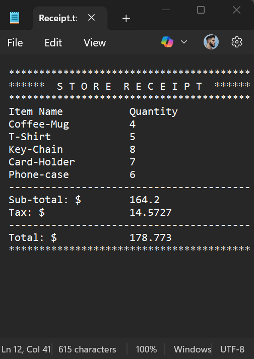

## 🧾 Sample Receipt

Here’s an example of a receipt generated by the system:



> Automatically calculated from an order file using NYC’s 8.875% sales tax.
> This receipt includes sub-total, tax, and grand total — just like a real store system.


## 💻 How to Run

1. Clone the repository:
   ```bash
   git clone https://github.com/GiuMarcoccio/CSC211_StoreSystem.git
   cd CSC211_StoreSystem

